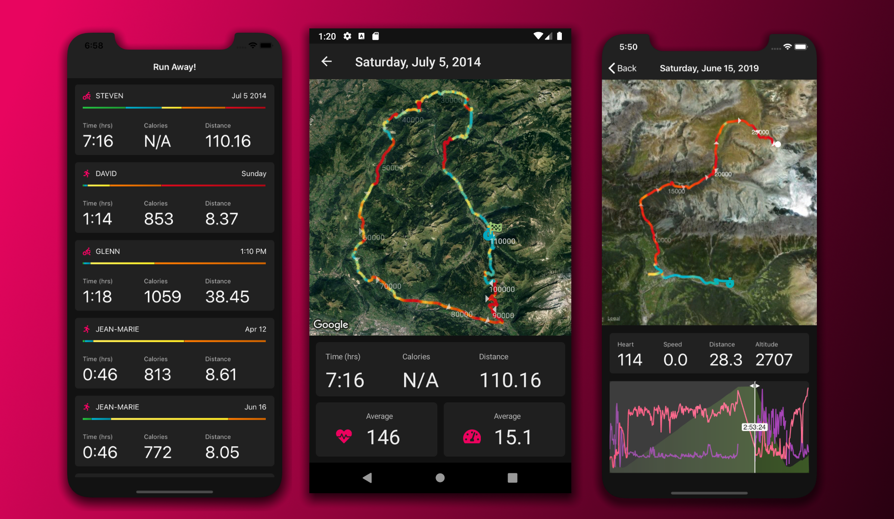
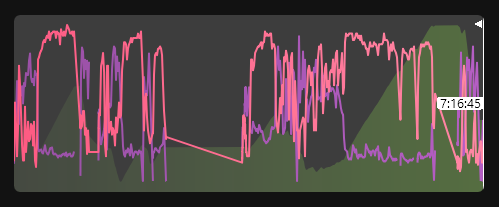
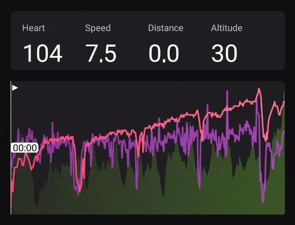
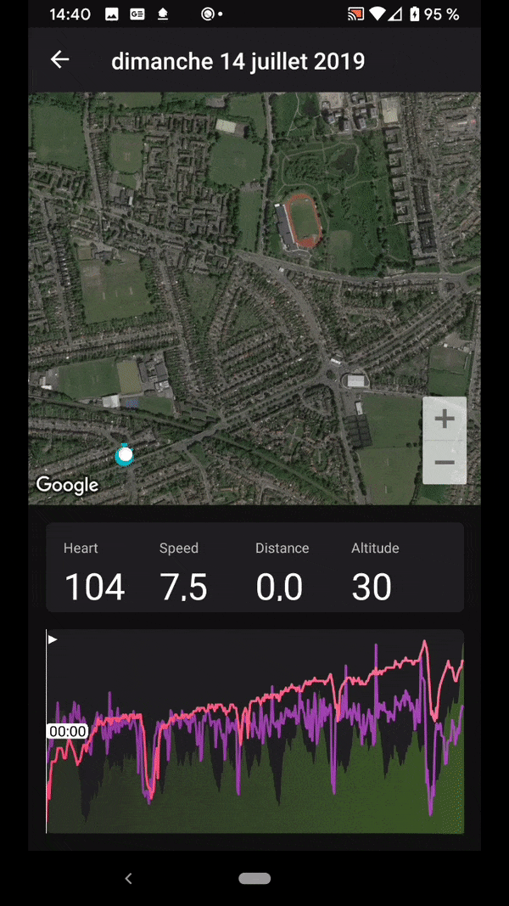

# SkiaSharpnado: SkiaSharp components and case studies for Xamarin.Forms



If you want real details on this, please see my 2 parts blog post on Sharpnado: 

1. https://www.sharpnado.com/run-away-app
2. https://www.sharpnado.com/drawing-curves-with-skiasharp

**WARNING**: there is a pending PR in the `Xamarin.Forms` github (https://github.com/xamarin/Xamarin.Forms/pull/7260) that will add needed property and events to `Xamarin.Forms.Maps`. For now you have to **clone** my fork of `Xamarin.Forms` (https://github.com/roubachof/Xamarin.Forms) at the same level that this repo.

For now, you will find two netstandard projects ready to be reused:

1. ```SkiaSharpnado```
2. ```SkiaSharpnado.Maps```

In the near future, I will release some SkiaSharp components through a SkiaSharpnado nuget package.

The ```SkiaSharpnado.Maps``` project contains all the bits to draw the gradient paths on Maps.
It may be also released as a nuget package: it will depend on if you want to :)

Those projects are used by the ```Sample``` project which is a ```Xamarin.Forms``` app targeting, iOS, Android AND UWP.
Yes, I didn't forget **UWP** this time, even if the result is not as good as the others platorm, but stay tuned for the disappointement :)

## Run Away! A training app displaying gradient lines on top of Google.Maps

So the activities you will see are extracted from real people running apps:

* [David Ortinau](https://twitter.com/davidortinau)
* [Glenn Versweyveld](https://twitter.com/Depechie)
* [Steven Thewisen](https://twitter.com/devnl)
* [Bart Lannoeye](https://twitter.com/bartlannoeye)
* [Dominique Louis](https://twitter.com/SoftSavage)

Thanks again to those great dedicated souls!

You can even export you own activities as TCX files, and add them in the Resources folder, it will pick them automatically.

**Remark:** I used [Google Material Dark theme](https://material.io/design/color/dark-theme.html) to design the app.

### The ActivityHeaderPage

<table>
	<thead>
		<tr>
			<th>Android</th>
			<th>iOS</th>
      <th>UWP</th>
		</tr>
	</thead>
	<tbody>
		<tr>
			<td></td>
			<td></td>
      <td></td>
		</tr>
  </tbody>
</table>

I used text semantic and followed the elevation color guidelines of the material design.

I used Font Awesome for the icons (thanks Xappy for the tutorial ;).

The only special thing about this screen is the little colored bar you can see below the activity title. These are not random colors. There are in fact the effort dispersion based on the heart rates of each activity.
The effort colors are defined in the ```Colors.xaml``` file:


* We can see that Steven's activity is the most balanced, it's quite an adventure, 7 hours of cycling. Steven climbed the Joux-Plane Pass, which is a famous stage of the "Tour de France". There were some calm moments, flat segments, going down the pass, and some really challenging ones: obviously going up the pass (9% average, 11km).

* David entry is really heart intensive with more than 50% of the time close to max heart rate. He went running on a very hot day at the beginning of the afternoon on a steep road (thank you again for your sacrifice :).

* Finally, Glenn pushed hard on the pedals on a rather flat area to achieve nearly 30 km/h on average. The effort was constant, quite strong (most of it qualifies as anaerobic span), with little variations.

#### SKColorDispersionBarView

So this bar is made with... SKIASHARP obviously, and the code is pretty simple.

```csharp
public class SKColorDispersionBarView : SKCanvasView
{
    public static readonly BindableProperty DispersionProperty =
        BindableProperty.Create(
            nameof(Dispersion),
            typeof(List<IDispersionSpan>),
            typeof(SKColorDispersionBarView),
            defaultValue: null,
            propertyChanged: DispersionPropertyChanged);

    public List<IDispersionSpan> Dispersion
    {
        get => (List<IDispersionSpan>)GetValue(DispersionProperty);
        set => SetValue(DispersionProperty, value);
    }
    private static void DispersionPropertyChanged(BindableObject bindable, object oldvalue, object newvalue)
    {
        var barView = (SKColorDispersionBarView)bindable;
        barView.InvalidateSurface();
    }

    protected override void OnPaintSurface(SKPaintSurfaceEventArgs e)
    {
        base.OnPaintSurface(e);

        SKSurface surface = e.Surface;
        SKCanvas canvas = surface.Canvas;

        canvas.Clear();

        if (Dispersion == null || Dispersion.Count == 0)
        {
            return;
        }

        float width = CanvasSize.Width;
        float height = CanvasSize.Height;
        double totalCount = Dispersion.Sum(d => d.Value);
        float currentX = 0;

        width -= SkiaHelper.ToPixel(Dispersion.Count - 1);

        using (var paint = new SKPaint { Style = SKPaintStyle.Fill })
        {
            foreach (var dispersionSpan in Dispersion)
            {
                double rectangleWidth = width * dispersionSpan.Value / totalCount;

                SKColor effortStartColor = dispersionSpan.Color.ToSKColor();
                SKColor effortTargetColor = effortStartColor.Darken();

                var upperLeft = new SKPoint(currentX, 0);
                var bottomRight = new SKPoint(currentX + (float)rectangleWidth, height);

                using (var shader = SKShader.CreateLinearGradient(
                    upperLeft,
                    bottomRight,
                    new[] { effortStartColor, effortTargetColor },
                    null,
                    SKShaderTileMode.Clamp))
                {
                    paint.Shader = shader;

                    canvas.DrawRect(new SKRect(upperLeft.X, upperLeft.Y, bottomRight.X, bottomRight.Y), paint);
                }

                currentX += (float)rectangleWidth + 1;
            }
        }
    }
}
```

The dispersion is computed in the ```ActivityHeaderPageViewModel```. What I call dispersion, is a list of DispersionSpan. In our app case, the DispersionSpan color is the effort color (given by the heart rate), and the value the total ms time spent in this effort interval.

### The ActivityPage

And now ladies and gentlemen, the long awaited moment, let's draw some gradient lines on Maps!

<table>
	<thead>
		<tr>
			<th>Android (Steven)</th>
			<th>iOS (David)</th>
      <th>UWP (Glenn)</th>
		</tr>
	</thead>
	<tbody>
		<tr>
			<td></td>
			<td></td>
      <td></td>
		</tr>
  </tbody>
</table>

Functionnally speaking, the colors displayed on the map are computed the same way than the ```SKColorDispersionBarView```: by the ```HumanEffortComputer```. The only thing that changed is that we interpolate the color to give that nice gradient touch. The start and end point are marked by icons colorized by the athlete heartrate at this precise moment.

* Steven's map is more colorful as we see earlier. Calories weren't exported for some reason, I'm thinking int overflow. Lots of heartrate variations, we can see clearly the top of the Pass, the effort goes from max (red) to light (blue). I suspect a quick break for a Pastis.
* David's path is painted in max effort with an impressive average rate of 159 bpm (I think I would have died at minute 3).
* Glenn track is yellow-orangish with a constant effort on a disappointing UWP implementation.

### The SessionMap view (SkiaSharpnado.Maps.Views)

This is our main piece.
It's made of the GoogleMaps component from the legendary [amay077](https://github.com/amay077), and a simple ```SkiaSharp``` overlay.

```xml
<?xml version="1.0" encoding="UTF-8"?>
<ContentView xmlns="http://xamarin.com/schemas/2014/forms"
             xmlns:x="http://schemas.microsoft.com/winfx/2009/xaml"
             xmlns:forms="clr-namespace:SkiaSharp.Views.Forms;assembly=SkiaSharp.Views.Forms"
             xmlns:googleMaps="clr-namespace:Xamarin.Forms.GoogleMaps;assembly=Xamarin.Forms.GoogleMaps"
             x:Class="SkiaSharpnado.Maps.Presentation.Views.SessionMap.SessionMap">
    <ContentView.Content>
        <Grid RowSpacing="0">
            <googleMaps:Map Grid.Row="0"
                            x:Name="GoogleMap"
                            MapType="Satellite" />

            <forms:SKCanvasView Grid.Row="0"
                                x:Name="MapOverlay"
                                InputTransparent="True"
                                PaintSurface="MapOnPaintSurface" />
        </Grid>
    </ContentView.Content>
</ContentView>
```

It has a ```PathThickness``` bindable property if you want some big thick fluffy gradient (here ```PathThickness="6"```):


Its input data is a ```SessionMapInfo```, which is basically a list of Gps points with session infos, the ```ISessionDisplayablePoint```.

```csharp
public static readonly BindableProperty SessionMapInfoProperty = BindableProperty.Create(
typeof(SessionMapInfo),
    nameof(SessionMapInfo),
    typeof(SessionMap),
    propertyChanged: SessionMapInfoChanged);
```

```csharp
public class SessionMapInfo
{
    public IReadOnlyList<SessionDisplayablePoint> SessionPoints { get; }

    public Bounds Region { get; }

    public int TotalDurationInSeconds { get; }
}

public interface ISessionDisplayablePoint
{
    TimeSpan Time { get; }

    Color MapPointColor { get; }

    int? Altitude { get; }

    int? HeartRate { get; }

    double? Speed { get; }

    LatLong Position { get; }

    bool HasMarker { get; }

    string Label { get; }

    int? Distance { get; }
}
```

In the cas of out Run Away! app, the ```SessionMapInfo``` is built in the ```ActivityPageViewModel``` as follows:

1. The selected tcx activity is retrieved from the ```ITcxActivityService```
2. The Tcx ```TrackPoint``` list is converted to domain ```ActivityPoint``` list
3. We specify some parameters like the number of markers and the distance label interval
4. Then ```SessionMap.Create``` factory is called and will compute speed, color from the ```EffortComputer```, distance, etc...

## Drawing curves with SkiaSharp


I created a `SessionGraphView` which is just a `SKCanvasView` with a touchable overlay:

```xml
<ContentView.Content>
    <Grid>
        <forms:SKCanvasView x:Name="Graph"
                            PaintSurface="GraphOnPaintSurface" />
        <Grid.Effects>
            <forms1:TouchEffect Capture="True"
                                TouchAction="OnTouchEffectAction" />
        </Grid.Effects>
    </Grid>
</ContentView.Content>
```

The touch effect comes from a well known `Xamarin.Forms` documentation on effects: https://docs.microsoft.com/en-US/xamarin/xamarin-forms/app-fundamentals/effects/touch-tracking.

Luckily someone made it a nuget package: https://www.nuget.org/packages/TouchTracking.Forms/

This will give us touch action like dragging.

I have two `BindableProperty`:

1. `SessionGraphInfoProperty`: gives all the info needed for displaying our curves
2. `CurrentCursorTimeProperty`: is current selected time



Now the interesting part is that the time cursor can be dragged around thanks to the `TouchEffect`:

```csharp
private void OnTouchEffectAction(object sender, TouchActionEventArgs args)
{
    if (args.Type == TouchActionType.Moved && SessionGraphInfo != null)
    {
        float positionX = SkiaHelper.ToPixel(args.Location.X);

        CurrentCursorTime = TimeSpan.FromSeconds(
            ComputationHelper.Clamp(
                SessionGraphInfo.TotalDurationInSeconds * positionX / Graph.CanvasSize.Width,
                0,
                SessionGraphInfo.TotalDurationInSeconds));

        Graph.InvalidateSurface();
    }
}
```

Which gives this:



### Composing

The indicators above the curves are not in the same views. I really love modularity and composition, so I try to make all my components pluggable between each others. The plug point is the `CurrentCursorTime` property. And the indicators are brought by the `ActivityPageViewModel`:

```csharp
public class ActivityPageViewModel : ViewModelBase
{
    private readonly ITcxActivityService _activityService;

    private TimeSpan _currentTime;
    private string _currentHeartRate;
    private string _currentSpeed;
    private string _currentAltitude;
    private string _currentDistance;

    public ActivityPageViewModel(INavigationService navigationService, ITcxActivityService activityService)
        : base(navigationService)
    {
        _activityService = activityService;

        Loader = new ViewModelLoader<SessionMapInfo>(emptyStateMessage: AppResources.EmptyActivityMessage);
    }

    public SessionGraphInfo GraphInfo { get; private set; }

    ...

    public TimeSpan CurrentTime
    {
        get => _currentTime;
        set
        {
            SetProperty(ref _currentTime, value);
            OnCurrentTimeChanged();
        }
    }

    public string CurrentHeartRate
    {
        get => _currentHeartRate;
        set => SetProperty(ref _currentHeartRate, value);
    }

    public string CurrentSpeed
    {
        get => _currentSpeed;
        set => SetProperty(ref _currentSpeed, value);
    }

    public string CurrentAltitude
    {
        get => _currentAltitude;
        set => SetProperty(ref _currentAltitude, value);
    }

    public string CurrentDistance
    {
        get => _currentDistance;
        set => SetProperty(ref _currentDistance, value);
    }

    ...

    private void OnCurrentTimeChanged()
    {
        if (GraphInfo == null)
        {
            return;
        }

        var currentPoint = GraphInfo.SessionPoints.First(p => p.Time >= CurrentTime);

        CurrentHeartRate = currentPoint.HeartRate?.ToString() ?? AppResources.NoValue;
        CurrentSpeed = currentPoint.Speed?.ToString("0.0") ?? AppResources.NoValue;
        CurrentAltitude = currentPoint.Altitude?.ToString() ?? AppResources.NoValue;
        CurrentDistance = currentPoint.Distance != null
            ? (currentPoint.Distance.Value / 1000f).ToString("0.0")
            : AppResources.NoValue;
    }

    ...
}
```

In the `ActivityPage`:

```xml
<graph:SessionGraphView x:Name="GraphView"
                        CurrentCursorTime="{Binding CurrentTime, Mode=OneWayToSource}"
                        SessionGraphInfo="{Binding GraphInfo}"/>
```

Now, I think you saw it coming, we can plug our `SessionGraphView` to our `SessionMap`:

```xml
<map:SessionMap x:Name="SessionMap" 
                PathThickness="4" 
                SessionMapInfo="{Binding Loader.Result}"
                MaxTime="{Binding Source={x:Reference GraphView}, Path=CurrentCursorTime, Mode=TwoWay}"/>
```

And...



## Final Thanks

Thanks again to David, Steven, Glenn, Bart and Dominique!

Huge thanks to [Matthew Leibowitz](https://twitter.com/mattleibow) who unleashed the infinite power of ```Xamarin.Forms``` with ```SkiaSharp```.
